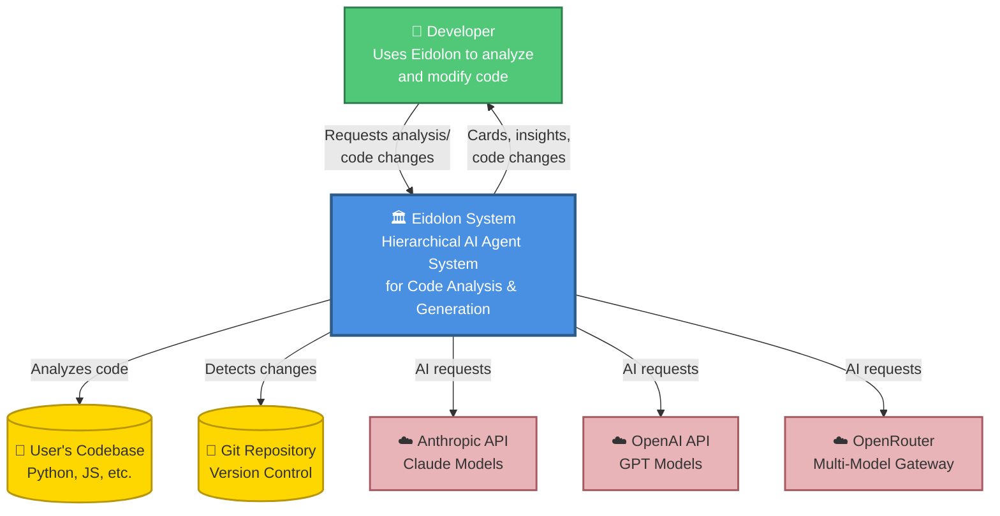
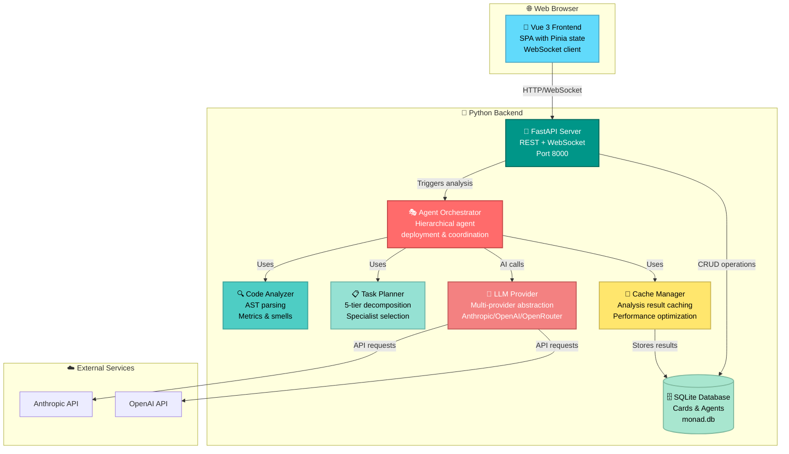
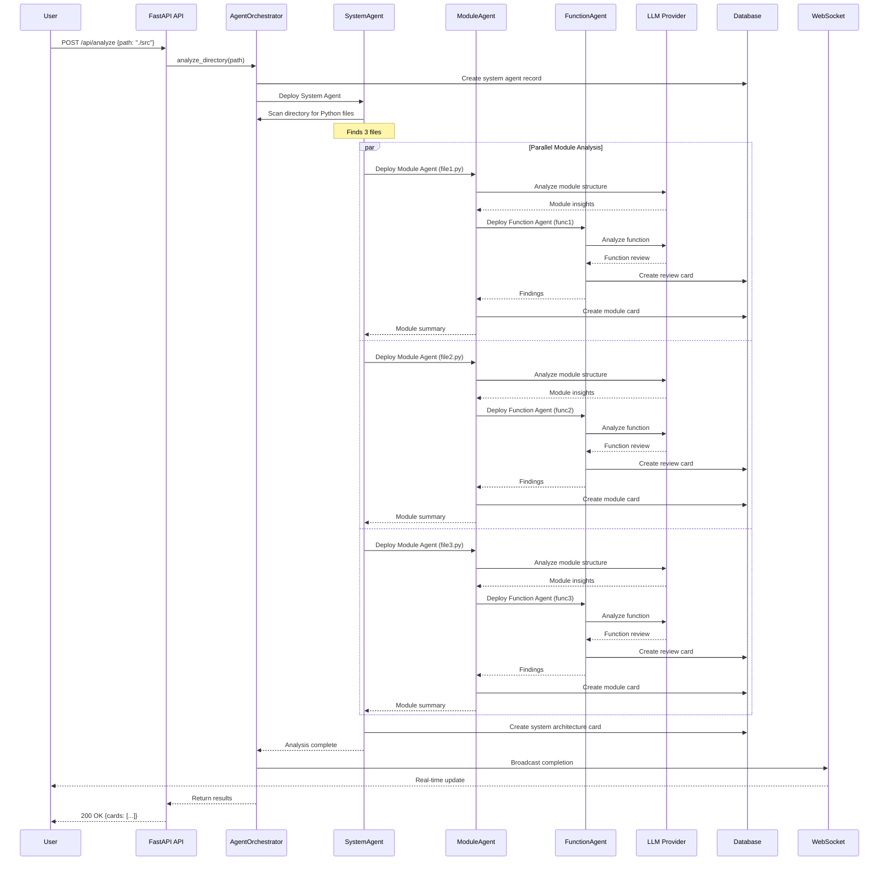
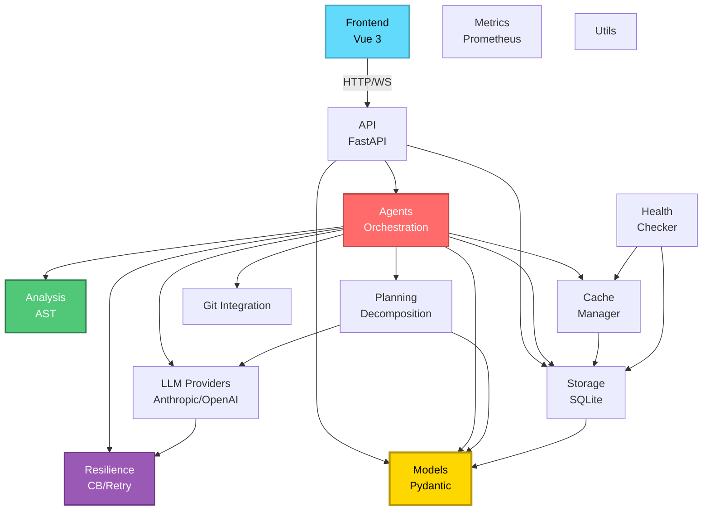

# Architecture Diagrams - Eidolon

**Analysis Date:** 2025-11-24
**Notation:** C4 Model (Context, Container, Component)
**Tool:** Mermaid + ASCII diagrams

---

## Table of Contents

1. [C1: System Context Diagram](#c1-system-context-diagram)
2. [C2: Container Diagram](#c2-container-diagram)
3. [C3: Component Diagram - Backend](#c3-component-diagram---backend)
4. [C4: Module Diagram - Orchestration Flow](#c4-module-diagram---orchestration-flow)
5. [Dependency Graph](#dependency-graph)
6. [Deployment Architecture](#deployment-architecture)

---

## C1: System Context Diagram

**Purpose:** Shows Eidolon in context with users and external systems



**Key Relationships:**
- Developer uses Eidolon web UI (Vue 3 frontend)
- Eidolon analyzes user's codebase via file system access
- Eidolon calls AI APIs for intelligent analysis
- Eidolon integrates with Git for incremental analysis

---

## C2: Container Diagram

**Purpose:** Shows high-level architecture containers



**Container Descriptions:**

| Container | Technology | Responsibility |
|-----------|------------|----------------|
| **Vue 3 Frontend** | Vue 3, Vite, Pinia | User interface with 3 tabs (Explore, Code, Plan), real-time updates |
| **FastAPI Server** | FastAPI, Uvicorn | REST API endpoints, WebSocket broadcasting |
| **Agent Orchestrator** | Python, asyncio | Coordinates hierarchical agents (System→Module→Function) |
| **Code Analyzer** | Python AST | Static analysis, complexity metrics, code smell detection |
| **Task Planner** | Python | Decomposes tasks into 5 tiers, selects specialists |
| **LLM Provider** | Anthropic SDK, OpenAI SDK | Abstracts AI provider, handles retries/rate limiting |
| **Cache Manager** | Python, hashlib | Caches analysis results to avoid redundant AI calls |
| **SQLite Database** | aiosqlite | Persists cards and agent session history |

---

## C3: Component Diagram - Backend

**Purpose:** Detailed view of backend internal structure

```
┌─────────────────────────────────────────────────────────────────────────┐
│                          EIDOLON BACKEND                                │
├─────────────────────────────────────────────────────────────────────────┤
│                                                                         │
│  ┌───────────────────────────────────────────────────────────────┐    │
│  │                      API LAYER                                 │    │
│  │  ┌──────────────┐  ┌──────────────┐  ┌──────────────┐        │    │
│  │  │ Card Routes  │  │ Agent Routes │  │ WebSocket    │        │    │
│  │  │ /api/cards   │  │ /api/agents  │  │ /api/ws      │        │    │
│  │  └──────┬───────┘  └──────┬───────┘  └──────┬───────┘        │    │
│  └─────────┼──────────────────┼──────────────────┼────────────────┘    │
│            │                  │                  │                     │
│  ┌─────────▼──────────────────▼──────────────────▼────────────────┐   │
│  │                   ORCHESTRATION LAYER                          │   │
│  │  ┌──────────────────────────────────────────────────────────┐ │   │
│  │  │           AgentOrchestrator                              │ │   │
│  │  │  • Hierarchical deployment (System→Module→Function)      │ │   │
│  │  │  • Parallel execution (semaphores)                       │ │   │
│  │  │  • Progress tracking                                     │ │   │
│  │  │  • Error recovery                                        │ │   │
│  │  └────┬─────────────────┬─────────────────┬─────────────────┘ │   │
│  │       │                 │                 │                   │   │
│  │  ┌────▼────┐      ┌────▼────┐      ┌────▼────────┐          │   │
│  │  │Business │      │Implemen-│      │Specialist   │          │   │
│  │  │Analyst  │      │tation   │      │Registry     │          │   │
│  │  │(1052LOC)│      │Orch.    │      │(Security,   │          │   │
│  │  └─────────┘      └─────────┘      │Testing,etc) │          │   │
│  │                                     └─────────────┘          │   │
│  └────────────────────────────────────────────────────────────────┘   │
│            │                  │                  │                     │
│  ┌─────────▼──────────────────▼──────────────────▼────────────────┐   │
│  │                    BUSINESS LOGIC LAYER                        │   │
│  │  ┌──────────┐  ┌──────────┐  ┌──────────┐  ┌──────────────┐  │   │
│  │  │ Analysis │  │ Planning │  │ Code     │  │ Git          │  │   │
│  │  │ (AST)    │  │ (5-tier) │  │ Graph    │  │ Integration  │  │   │
│  │  └──────────┘  └──────────┘  └──────────┘  └──────────────┘  │   │
│  │  ┌──────────┐  ┌──────────┐  ┌──────────┐  ┌──────────────┐  │   │
│  │  │ Linting  │  │ Test Gen │  │ Code     │  │ Design       │  │   │
│  │  │ Agent    │  │          │  │ Writer   │  │ Context      │  │   │
│  │  └──────────┘  └──────────┘  └──────────┘  └──────────────┘  │   │
│  └────────────────────────────────────────────────────────────────┘   │
│            │                  │                  │                     │
│  ┌─────────▼──────────────────▼──────────────────▼────────────────┐   │
│  │                   INFRASTRUCTURE LAYER                         │   │
│  │  ┌──────────┐  ┌──────────┐  ┌──────────┐  ┌──────────────┐  │   │
│  │  │ LLM      │  │ Storage  │  │ Cache    │  │ Resilience   │  │   │
│  │  │ Providers│  │ (SQLite) │  │ Manager  │  │ (Retry/CB)   │  │   │
│  │  └──────────┘  └──────────┘  └──────────┘  └──────────────┘  │   │
│  │  ┌──────────┐  ┌──────────┐  ┌──────────┐  ┌──────────────┐  │   │
│  │  │ Health   │  │ Metrics  │  │ Logging  │  │ Request      │  │   │
│  │  │ Checker  │  │(Prometheus)│ │(structlog)│ │ Context      │  │   │
│  │  └──────────┘  └──────────┘  └──────────┘  └──────────────┘  │   │
│  └────────────────────────────────────────────────────────────────┘   │
│            │                  │                  │                     │
│  ┌─────────▼──────────────────▼──────────────────▼────────────────┐   │
│  │                       DATA MODELS                              │   │
│  │  ┌──────────┐  ┌──────────┐  ┌──────────┐                     │   │
│  │  │ Card     │  │ Agent    │  │ Task     │                     │   │
│  │  │ (Pydantic)│ │ (Pydantic)│ │ (Pydantic)│                     │   │
│  │  └──────────┘  └──────────┘  └──────────┘                     │   │
│  └────────────────────────────────────────────────────────────────┘   │
│                                                                         │
└─────────────────────────────────────────────────────────────────────────┘
```

---

## C4: Module Diagram - Orchestration Flow

**Purpose:** Shows how hierarchical agent orchestration works



**Key Flow Characteristics:**
1. **Hierarchical Deployment:** System → Module → Function
2. **Parallel Execution:** Multiple modules analyzed concurrently (semaphore-controlled)
3. **Bottom-up Synthesis:** Findings flow upward (Function → Module → System)
4. **Real-time Updates:** WebSocket broadcasts progress
5. **Resilience:** All LLM calls wrapped with retry/timeout/circuit breaker

---

## Dependency Graph

**Purpose:** Shows subsystem dependencies



**Dependency Analysis:**

**Low Coupling (Good):**
- Analysis → Only stdlib (ast)
- Resilience → Only stdlib
- Cache → Minimal deps
- Git → Only stdlib (subprocess)
- Utils → Only stdlib

**Medium Coupling:**
- LLM Providers → 2 external SDKs + logging
- Storage → Models + aiosqlite
- Planning → Models + LLM

**High Coupling (Expected):**
- Agents (Orchestrator) → 8+ dependencies (central hub)
- API → 3-4 dependencies (gateway)

---

## Deployment Architecture

**Purpose:** Shows production deployment setup

```
┌─────────────────────────────────────────────────────────────────┐
│                         PRODUCTION                              │
├─────────────────────────────────────────────────────────────────┤
│                                                                 │
│  ┌────────────────────────────────────────────────────────┐    │
│  │                   LOAD BALANCER                        │    │
│  │              (Nginx / AWS ALB)                         │    │
│  └───────────┬────────────────────────────┬───────────────┘    │
│              │                            │                     │
│  ┌───────────▼──────────┐    ┌───────────▼──────────┐         │
│  │   Frontend CDN       │    │   Backend Cluster     │         │
│  │   (Static Assets)    │    │   (Docker/K8s)        │         │
│  │                      │    │                       │         │
│  │  - index.html        │    │  ┌─────────────────┐ │         │
│  │  - Vue 3 bundles     │    │  │  API Pod 1      │ │         │
│  │  - CSS/images        │    │  │  Port 8000      │ │         │
│  │                      │    │  └────────┬────────┘ │         │
│  └──────────────────────┘    │           │          │         │
│                              │  ┌────────▼────────┐ │         │
│                              │  │  API Pod 2      │ │         │
│                              │  │  Port 8000      │ │         │
│                              │  └────────┬────────┘ │         │
│                              │           │          │         │
│                              │  ┌────────▼────────┐ │         │
│                              │  │  API Pod 3      │ │         │
│                              │  │  Port 8000      │ │         │
│                              │  └────────┬────────┘ │         │
│                              └───────────┼──────────┘         │
│                                          │                     │
│  ┌───────────────────────────────────────▼──────────────────┐ │
│  │                  SHARED SERVICES                         │ │
│  │                                                          │ │
│  │  ┌──────────────┐  ┌──────────────┐  ┌──────────────┐  │ │
│  │  │ PostgreSQL   │  │ Redis        │  │ Prometheus   │  │ │
│  │  │ (Cards/      │  │ (WebSocket   │  │ (Metrics)    │  │ │
│  │  │  Agents)     │  │  PubSub)     │  │              │  │ │
│  │  └──────────────┘  └──────────────┘  └──────────────┘  │ │
│  │                                                          │ │
│  │  ┌──────────────┐  ┌──────────────┐  ┌──────────────┐  │ │
│  │  │ Grafana      │  │ ELK Stack    │  │ Secret Vault │  │ │
│  │  │ (Dashboards) │  │ (Logs)       │  │ (API Keys)   │  │ │
│  │  └──────────────┘  └──────────────┘  └──────────────┘  │ │
│  └──────────────────────────────────────────────────────────┘ │
│                                                                 │
└─────────────────────────────────────────────────────────────────┘
                              │
                              │
                    ┌─────────▼──────────┐
                    │  EXTERNAL SERVICES │
                    │                    │
                    │  • Anthropic API   │
                    │  • OpenAI API      │
                    │  • OpenRouter      │
                    └────────────────────┘
```

**MVP Deployment (Current):**
```
┌─────────────────────────────────────┐
│       LOCAL DEVELOPMENT             │
├─────────────────────────────────────┤
│                                     │
│  Frontend (npm run dev)             │
│  └─> http://localhost:5173          │
│                                     │
│  Backend (uvicorn)                  │
│  └─> http://localhost:8000          │
│                                     │
│  Database (SQLite)                  │
│  └─> ./monad.db                     │
│                                     │
└─────────────────────────────────────┘
```

---

## Data Flow Diagram

**Purpose:** Shows how data flows through the system

```
┌──────────┐
│  User    │
│  Request │
└────┬─────┘
     │
     │ 1. POST /api/analyze
     ▼
┌─────────────────┐
│  FastAPI API    │
│  • Validates    │
│  • Creates task │
└────┬────────────┘
     │
     │ 2. Trigger analysis
     ▼
┌──────────────────────┐
│  AgentOrchestrator   │
│  • Checks cache      │◄──────┐
│  • Deploys agents    │       │
└────┬─────────────────┘       │
     │                         │
     │ 3. Analyze code         │ 6. Cache hit?
     ▼                         │
┌──────────────────────┐       │
│  Code Analyzer       │       │
│  • AST parsing       │       │
│  • Metrics calc      │       │
└────┬─────────────────┘       │
     │                         │
     │ 4. Need AI analysis     │
     ▼                         │
┌──────────────────────┐       │
│  LLM Provider        │       │
│  • Resilience wrap   │       │
│  • API call          │       │
└────┬─────────────────┘       │
     │                         │
     │ 5. Store results        │
     ▼                         │
┌──────────────────────┐       │
│  Database            │       │
│  • Cards             │       │
│  • Agent sessions    │       │
└────┬─────────────────┘       │
     │                         │
     └─────────────────────────┘
     │
     │ 7. Return to user
     ▼
┌──────────────────────┐
│  WebSocket Broadcast │
│  • Real-time update  │
└────┬─────────────────┘
     │
     ▼
┌──────────┐
│  User    │
│  Gets    │
│  Cards   │
└──────────┘
```

---

## Technology Stack Diagram

```
┌─────────────────────────────────────────────────────────────┐
│                    EIDOLON TECH STACK                       │
├─────────────────────────────────────────────────────────────┤
│                                                             │
│  FRONTEND                                                   │
│  ┌─────────────────────────────────────────────────────┐   │
│  │ Vue 3 (Composition API)                             │   │
│  │ Vite (Build tool)                                   │   │
│  │ Pinia (State management)                            │   │
│  │ Axios (HTTP client)                                 │   │
│  │ WebSocket API (Real-time)                           │   │
│  └─────────────────────────────────────────────────────┘   │
│                                                             │
│  BACKEND                                                    │
│  ┌─────────────────────────────────────────────────────┐   │
│  │ Python 3.10+                                        │   │
│  │ FastAPI 0.115.0 (Web framework)                     │   │
│  │ Uvicorn 0.32.0 (ASGI server)                        │   │
│  │ Pydantic 2.10.5 (Data validation)                   │   │
│  │ aiosqlite 0.20.0 (Async SQLite)                     │   │
│  │ structlog 24.4.0 (Logging)                          │   │
│  │ prometheus-client 0.21.0 (Metrics)                  │   │
│  │ networkx 3.2.1+ (Graph analysis)                    │   │
│  └─────────────────────────────────────────────────────┘   │
│                                                             │
│  AI/LLM                                                     │
│  ┌─────────────────────────────────────────────────────┐   │
│  │ Anthropic SDK 0.39.0 (Claude)                       │   │
│  │ OpenAI SDK 1.58.1 (GPT + compatible)                │   │
│  │ Custom LLM abstraction layer                        │   │
│  └─────────────────────────────────────────────────────┘   │
│                                                             │
│  BUILD & TOOLING                                            │
│  ┌─────────────────────────────────────────────────────┐   │
│  │ uv (Modern Python package manager)                  │   │
│  │ pyproject.toml (PEP 621 config)                     │   │
│  │ pytest 8.3.0+ (Testing)                             │   │
│  │ ruff 0.6.9+ (Linting)                               │   │
│  │ mypy 1.11.0+ (Type checking)                        │   │
│  └─────────────────────────────────────────────────────┘   │
│                                                             │
└─────────────────────────────────────────────────────────────┘
```

---

## Summary

**Diagrams Created:**
1. ✅ C1 System Context - Eidolon in environment
2. ✅ C2 Container Diagram - High-level architecture
3. ✅ C3 Component Diagram - Backend internal structure
4. ✅ C4 Module Diagram - Orchestration flow
5. ✅ Dependency Graph - Subsystem relationships
6. ✅ Deployment Architecture - Production vs MVP
7. ✅ Data Flow Diagram - Request lifecycle
8. ✅ Technology Stack - Complete tech overview

**Key Architectural Insights:**
- Clean layered architecture (Frontend → API → Orchestration → Business Logic → Infrastructure)
- Hierarchical agent pattern (System → Module → Function)
- Low coupling in core libraries (analysis, resilience, cache, git)
- Multi-provider abstraction enables flexibility
- Production-ready observability (metrics, health, logging)
- WebSocket for real-time user experience

**Next Steps:**
- Review diagrams for accuracy
- Update ARCHITECTURE.md with these diagrams
- Generate PlantUML versions if needed for documentation
